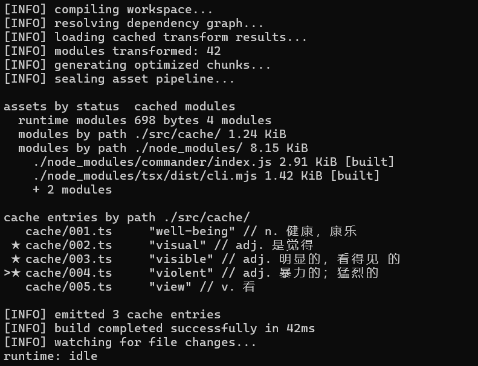

# Touch Fish

<p align="center">
  <strong>Learn in the gaps. Stay in the terminal.</strong><br>
  A stealth terminal learning tool disguised as development output.
</p>

<p align="center">
  <a href="https://github.com/hahahaliuliu/touch-fish/actions/workflows/ci.yml"></a>
  
  
  <a href="LICENSE"></a>
</p>



Touch Fish 是一个适合开发间隙使用的终端学习工具。

它把背单词和小说阅读呈现成开发日志、构建输出等终端内容，让用户在等待构建、工具响应或上下文切换时，顺手学习或阅读。

> Learn in the gaps. Stay in the terminal.

当前正式发布版本为 `v0.4.0`。

## 安装与启动

### 1. 环境准备

先检查当前环境中是否已经安装 Node.js 和 npm：

```shell
node --version
npm --version
```

Touch Fish 当前需要：

- Node.js `>= 22.12.0`
- npm 可以正常运行

推荐使用 Node.js 24 LTS。如果两个命令都能显示版本，并且 Node.js 版本符合要求，可以直接跳到“获取项目”。

如果命令不存在或 Node.js 版本太低，请根据自己的系统安装或升级 Node.js。

#### Windows 安装

可以从 [Node.js 官网](https://nodejs.org/)下载安装 Node.js 24 LTS，也可以使用 Windows Package Manager：

```powershell
winget install OpenJS.NodeJS.LTS
```

#### Ubuntu / WSL 安装

推荐使用 [nvm](https://github.com/nvm-sh/nvm) 管理 Node.js：

```bash
curl -o- https://raw.githubusercontent.com/nvm-sh/nvm/v0.40.4/install.sh | bash
source ~/.bashrc
nvm install 24
nvm alias default 24
```

安装或升级完成后，请重新检查版本：

```shell
node --version
npm --version
```

两个命令都能正常显示版本，才表示运行环境准备完成。

### 2. 获取项目

可以任选一种方式。

使用 Git：

```shell
git clone https://github.com/hahahaliuliu/touch-fish.git
cd touch-fish
```

不使用 Git：

1. 在 GitHub 项目页面点击 `Code`。
2. 点击 `Download ZIP`。
3. 解压文件。
4. 在解压后的项目文件夹中打开终端。

后续命令都必须在包含 `package.json` 的项目根目录执行。

### 3. 安装项目依赖

进入克隆或解压后的 Touch Fish 项目根目录，也就是包含 `package.json` 的目录，然后执行：

```shell
npm install
```

依赖会安装到项目自己的 `node_modules/` 目录。

### 4. 启动 Word 或 Read Session

在项目根目录中，使用开发方式启动：

```shell
npm run dev -- word
```

看到开发日志风格的单词界面，就表示安装和启动成功。

启动小说阅读：

```shell
npm run dev -- read
```

仓库自带 UTF-8 TXT 示例小说；也可以在 Read 设置中导入自己的本地 TXT 小说。

### 5. 在任意目录使用 `touchfish`

在项目根目录执行一次：

```shell
npm link
```

之后可以在当前系统的任意目录启动：

```shell
touchfish word
```

浏览收藏单词或打开 Word 设置：

```shell
touchfish word -f
touchfish word -s
```

启动阅读或打开 Read 设置：

```shell
touchfish read
touchfish read -s
touchfish read -m
```

查看核心命令：

```shell
touchfish
```

`touchfish` 会显示当前版本和核心命令。Word 和 Read 的设置分别通过 `touchfish word -s` 与 `touchfish read -s` 打开。

`npm link` 通常只需执行一次。请不要移动或删除项目目录；如果通过 nvm 更换了 Node.js 版本，可能需要重新执行 `npm link`。

## 第一次使用 Word

仓库自带一份 30 词示例词书：

```text
assets/vocabulary/ielts.example.json
```

没有安装其他词书时，Touch Fish 会自动使用它，因此第一次启动不需要手动准备词书。

在 Word Session 中按 `Ctrl+O` 可以打开 Settings。Settings 支持：

- 调整每页单词数量和学习组大小
- 切换顺序、倒序或随机学习
- 切换终端伪装主题
- 控制备注的隐藏、显示和编辑
- 自定义快捷键
- 下载、切换或卸载词书
- 导入 JSON、TXT、CSV 或带可复制文本的 PDF 词书

词书下载说明见 [docs/vocabulary-downloads.md](docs/vocabulary-downloads.md)，自定义词书格式见 [docs/vocabulary-format.md](docs/vocabulary-format.md)。

## Word 常用快捷键

| 按键 | 作用 |
| --- | --- |
| `A` / `←` | 当前范围内上一页 |
| `D` / `→` | 当前范围内下一页 |
| `[` / `↑` | 上一学习组 |
| `]` / `↓` | 下一学习组 |
| `Space` | 重复上一次导航 |
| `Tab` | 切换单词显示模式 |
| `T` | 开始当前学习组测试 |
| `E` | 在“备注：可编辑”时选择并编辑本页单词备注 |
| `F` | 在选择模式中收藏或取消收藏 |
| `Ctrl+O` | 打开 Settings；在 Settings 中返回 Word |
| `?` | 打开或关闭 Help |
| `Esc` | 从 Help 返回；在 Settings 中取消编辑或返回 Word |
| `Q` | 保存进度并退出 |

选择模式中，`E` 进入、`Esc` 退出；上下键移动光标，`F` 收藏或取消收藏，`Enter` 在备注可编辑时进入备注编辑。

快捷键可以在 Settings 中修改。

## Word 功能

- CLI 入口：`touchfish word`、`touchfish word -s`、`touchfish word -f`
- 终端 Word Session 和键盘交互
- 自定义每页单词数量
- 可选学习分组和自定义组大小
- 分组内循环与整本词书连续浏览
- 顺序、倒序和随机学习模式，并分别保存进度
- 英文、中文、英文 + 中文显示模式
- 当前学习组测试，支持双向测试
- 测试结果页显示用户答案、标准答案，并支持重新测试错题
- Build Log、Backend Log 和 Git 终端主题
- Word Settings、Help 和词书管理界面的中英文切换
- 单词备注的隐藏、显示和本地编辑
- 本地学习进度、用户设置和收藏保存
- 词书自动发现、下载、卸载和本地导入
- Word 设置页的响应式三列布局和安全退出清屏

## 第一次使用 Read

仓库自带一篇 UTF-8 TXT 示例小说。运行 `touchfish read` 会继续上次阅读；运行 `touchfish read -s` 可以：

- 切换当前小说；
- 从任意本地路径导入 UTF-8 TXT 小说；导入成功后原文件可以移动或删除；
- 查看和删除已经导入的小说，并同步清理对应阅读进度；
- 设置正文宽度、每页行数和章节切分份数；
- 切换中英文界面和 Build Log、Backend Log、Git 伪装主题；
- 自定义翻页、章节或小节导航、重复操作和 Help 按键。

章节切分只在自然段开头建立小节边界，不会从一段话中间切开。开启后，W/S 与上下方向键按小节导航。

## Read 常用快捷键

| 按键 | 作用 |
| --- | --- |
| `A` / `←` | 上一页 |
| `D` / `→` | 下一页 |
| `W` / `↑` | 上一章；开启章节切分后为上一小节 |
| `S` / `↓` | 下一章；开启章节切分后为下一小节 |
| `Space` | 重复上一次阅读操作 |
| `Ctrl+O` | 打开 Read 设置；在设置中返回阅读 |
| `?` | 打开或关闭 Help |
| `Esc` | 从 Help 返回；在设置中取消编辑或返回阅读；阅读页中保存并退出 |
| `Q` / `Ctrl+C` | 保存阅读进度并退出 |
| `鼠标右键` | 默认打开或关闭小窗口；可在设置中修改 |

除 `Ctrl+O`、Esc、Q 和 Ctrl+C 外，阅读快捷键可以在 Read 设置中修改。

## Read 功能

- CLI 入口：`touchfish read`、`touchfish read -s`、`touchfish read -m`
- 本地 UTF-8 TXT 小说导入、切换、删除和每本小说独立阅读进度
- 中英文宽度适配分页、章节识别和按自然段边界进行章节切分
- Read 独立设置、快捷键、Help 和三种终端伪装主题
- Windows Terminal 小窗口阅读、尺寸与字体设置、边框拖动保存和两种鼠标滚轮模式
- Read 设置页的响应式三列布局和安全退出清屏

### 小窗口阅读

在 Windows Terminal 中运行 `touchfish read -m`，会打开独立的小窗口显示小说正文，原窗口保留伪装内容并继续作为程序宿主运行。

Read 设置支持调整小窗口宽度、高度、字体大小、滚轮模式和逐行滚动速率。拖动小窗口边框改变尺寸后，实际尺寸会自动保存并用于下次启动。

鼠标滚轮可以设置为左右翻页或上下逐行滚动。逐行滚动时会临时标记上次位置，停止滚动后自动隐藏，并且不会改变正文排版。

默认使用鼠标右键快速打开或关闭小窗口，也可以在按键绑定中修改。小说导入页面不响应小窗口右键，右键仍可用于粘贴文件路径。

在小窗口中按 `Q`、`Ctrl+C` 或小窗口开关键，只关闭小窗口并保存进度，原窗口中的程序继续运行；在原窗口中按 `Q` 或 `Ctrl+C` 才会退出整个程序。

## 开发与测试

运行自动测试：

```shell
npm test
```

当前自动测试共 129 项，覆盖 Word、Read、小窗口、渲染、进度存储、素材管理和 CLI Session 交互，并在 Ubuntu 与 Windows 上运行 Node.js CI。

不使用全局链接时打开模块设置：

```shell
npm run dev -- word -s
npm run dev -- read -s
```

项目主要结构：

```text
src/
  commands/   CLI 命令入口
  session/    Session 生命周期
  services/   业务逻辑
  storage/    本地存储
  models/     数据模型
  config/     默认配置和路径
  ui/         终端渲染和主题

assets/
  vocabulary/ 词书
  progress/   本地进度
  reading/    本地 TXT 小说
  read-progress/ 每本小说的阅读进度

docs/         格式说明和开发计划
```
